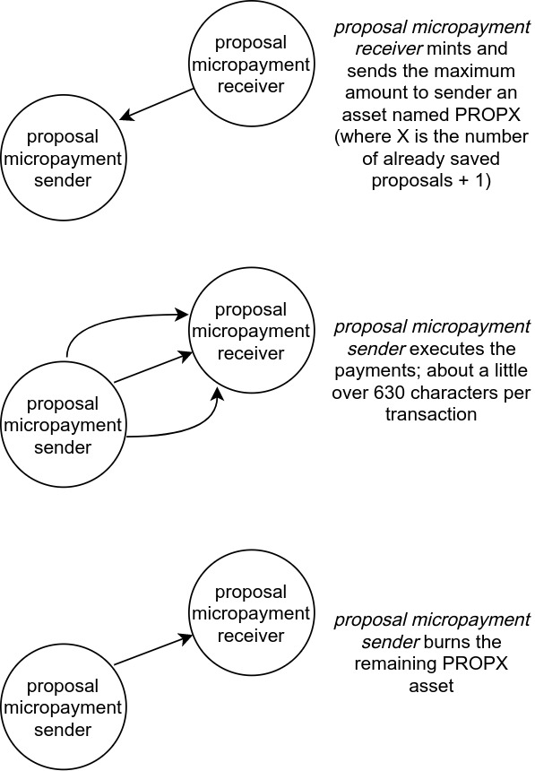

# gov

Governance engine for PlutoDAO

## Overview

PlutoDAO's governance engine allows for proposal creation and provides a voting mechanism in a completely decentralized way, ensuring full transparency of its operation.

## How does it work?

It works by codifying the proposal into payments between two accounts using custom assets that act as separate "databases" on the blockchain. We generate the micropayment figures by first taking the proposal object as a string literal:

`{name:"proposal name", "description": "a proposal description", "creator": ... `

and converting it to hexadecimal:

`7b6e616d653a2270726f706f73616c206e616d65222c20226465736372697074696f6e22...`

then to decimal:

`23978590229967689911409289390650971459145081537595864368212558790...`

that number is split into segments of 16 characters:

```
2397859022996768
9911409289390650
9714591450815375
....
```

and finally we divide each of those segments by 100000000:

```
239785902.2996768
991140928.9390650
971459145.0815375
....
```

by using the full extent of decimal precision allowed by the Stellar network we reduce by 7 degrees of magnitude the amount of assets needed to save the proposal on the blockchain.

The interactions between the aforementioned accounts are as follows:



All of those transactions incur in fee costs, which are covered by the proposal creator user. However, taking into account that each operation costs about 0.00001 XLM, thousands of characters can be saved for a very small amount.

The voting mechanism is much simpler, the voter sends a claimable balance to an escrow account (this account has a signing weight of 0), with a memo text carrying the information of the proposal Id (the name of the asset used to make the micropayments) and the selected option, for example: `"PROP3 AGAINST"`. The voter can choose which asset to lock from a list of allowed/whitelisted assets for that particular proposal, each whitelisted asset has a multiplier that will be taken into consideration at the vote count time (check the [gov-worker repository](https://github.com/PlutoDAO/gov-worker) for more information about the vote count process).

## Requirements
* .NET 5
* Docker
* docker-compose

## Installation

Execute

1. `dotnet restore`
2. `dotnet build`
3. `dotnet run`

Or simply `dotnet run`

## How to run integration tests
1) Copy the file `PlutoDAO.Gov.Test.Integration/appsettings.test.json.dist` name it `appsettings.dev.json` and place it in `PlutoDAO.Gov.Test.Integration/bin/Debug/net5.0/`
2) Run docker-compose up from within `PlutoDAO.Gov.Test.Integration` directory, now you'll have a local instance of Stellar running on your localhost on port 8000
3) Execute `dotnet test`

## Considerations when implementing a frontend
The mechanism for saving proposals incur in fee costs that have to be paid by the proposal creator user. So keep in mind that before sending the proposal to the backend write a claimable balance from the proposal creator user to the _proposal micropayment sender_ account with enough XLM to afford those fee costs, after the proposal has been saved the exceeding amount of XLM will be paid back to the proposal creator user.

## Community
Join PlutoDAO community at [Discord](https://discord.gg/xvDPZ3ZY6d)!
